I’m going to walk you through creating your first piece of generative art — that’s art that’s made in whole or part by a self-governed system. Anyone can follow along with this tutorial, I won’t be assuming programming knowledge and we’ll be using an online editor to remove the need for any setup.

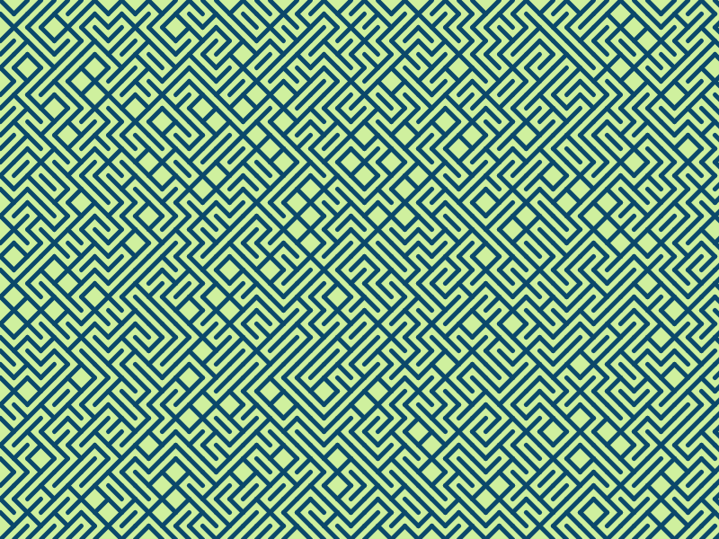

The simple piece of generative art we’re going to work on in this tutorial

Since the earliest days of the computer, people have been using code to make art. The image above is one of the more famous examples, written in BASIC in the early 1980s.

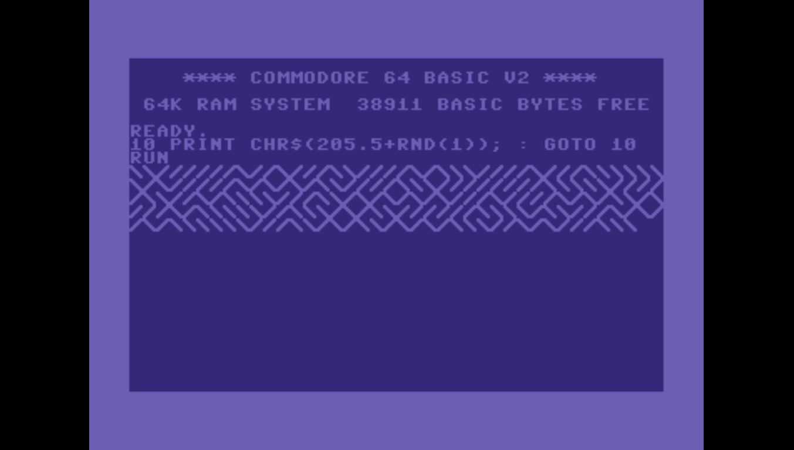

This image is made by randomly drawing either a left-to-right line or a right-to-left line. When we do this in a grid you get the randomly generated maze-like patterns you see above. And each time the program is run the pattern is different. At the end of the tutorial, we’ll explore a couple of different variations we can apply once we have the basic pattern down.

We’re going to recreate this pattern in [p5.js](http://p5js.org/), a javascript library that makes programming more accessible for artists. Throughout the tutorial, I encourage you to both write out the code and try different things with it. Try changing the numbers around, try out different colours, see what happens when you change the order of things. Playing around with the code like this is a great way to learn!

## Writing your first lines of code

Head over to [editor.p5js.org](https://editor.p5js.org/), I encourage you to sign up as it will let you save your code and come back to it later, but if you’d rather not and don’t mind losing your work, you will be able to follow along with this tutorial without being logged in.


This is what you’ll see when you first open the editor. If you press the play button you’ll see a grey square shows up on the right-hand side. Try changing the numbers and see what happens. After you change something you’ll have to click the play button again to get the image on the right to update.

Let’s talk a little bit about what’s on your screen right now.

On the right side of the window is where you type code, which what we’ll be using to make our generative art. Code is a precise way of explaining something and it is written in a programming language. Languages like English or Arabic are a way for humans to communicate with each other, and they can be very ambiguous. Programming languages, on the other hand, are a way for humans to communicate with computers and they are very precise. If you told someone to draw a line they might draw a random line, a computer will want to know exactly where you want the line drawn.

On the left side of the screen, we have the sketch. In your code, you describe to the computer what you want to get drawn, and this will appear on the right side in your sketch.

You might have figured out changing the number inside brackets of the `background` command only sets the colour to greyscale, don’t worry though we have lots more colours to play with. Let’s start off by changing the background colour and making some circles.

```javascript
function draw() {  
  background('PEACHPUFF');  
  ellipse(50,50,100);  
  ellipse(200,200,50);  
}
```

Type that out and run it by clicking the play button to see what happens.

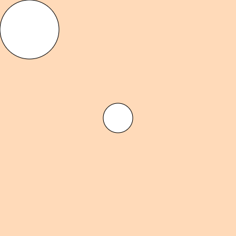

You might be wondering where I got the colour PEACHPUFF from. When we’re working in the browser we have access to quite a few named colours, often called CSS colours. You can check out some of these colours [here](http://colours.neilorangepeel.com/). Try changing the numbers inside of the ellipse brackets, and try setting the background to different CSS colours. Notice that you have to put the colour name inside of quotation marks.

## Coordinates and lines

Before we get on to the exciting task of drawing a line, I want to explain a little bit more what the code we’ve already written is doing:

```
ellipse(50,50,100);
```

If you’ve run this code you may have noticed it’s drawing a circle, but what do these numbers next to the `ellipse` command do? When we give the computer a command we can also give it information about how to perform that command. When a command in Javascript (the language we’re using) is followed by two brackets we say that we’re calling a function. If that sentence doesn’t make sense to you, don’t worry about it. It’ll make more sense as you do some more coding. The `ellipse` function can take three pieces of information: an x-coordinate, a y-coordinate, and a diameter.

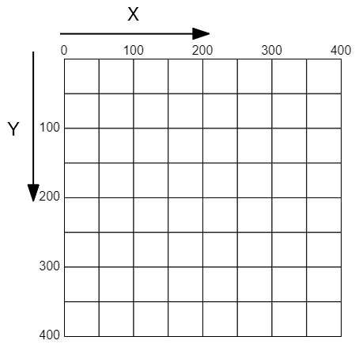

This is what the coordinate system for your sketch looks like. It’s 400 pixels wide and 400 pixels high. The bigger the x-coordinate you give to your shapes the further to the right they’ll be. And the bigger the y-coordinate you give to your shapes the further down they’ll be.

Using this, let’s have a look at how we might draw a line. Have a think about the kind of information the computer might need to draw a line.

```
line(0,0,400,400);
```

So it takes 4 pieces of information. If you’ve tried adding this to your sketch you might have guessed that those pieces of information are: the starting x position, the starting y position, the ending x position and the ending y position.

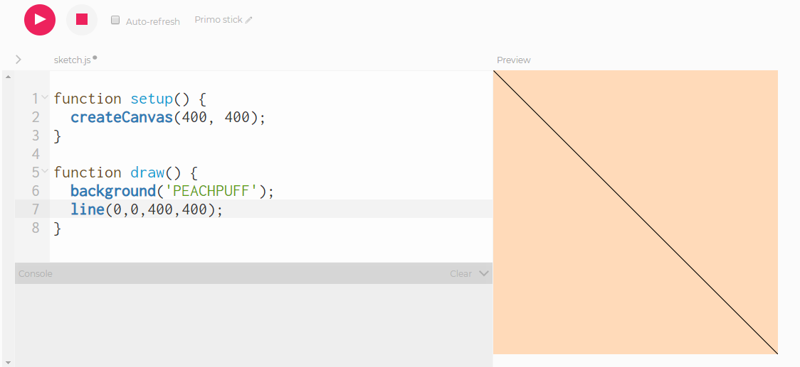

Remember to click play to update your sketch

So now we can draw a line that goes diagonally from left to right, we’ll call that our left line. We need to be able to draw a line that goes from right to left as well to make the pattern, we’ll call that our right line. Have a play with those numbers first to see if you can figure it out. It might help to look at the coordinate system pictured earlier.

For this line, rather than starting at the top left corner, we’ll start in the top right corner `400,0` and then we’ll end in the bottom left corner `0,400`:

```
line(400,0,0,400);
```

## Randomness and conditionals

Now that we can draw the two different lines, we want a way to randomly select between the left line and the right line. To do this we first need some way of introducing randomness:

```
random()
```

This command will result in a random value between 0 and 1. That means around half the time the value will be bigger than 0.5 and around half the time the value will be less than 0.5. So what we could do is use the `random()` command and draw a left line if the value is bigger than 0.5, otherwise, we draw the right-to-left line.

To choose whether or not to do something based on some condition we use a conditional, specifically an if-else statement. This statement checks a condition and performs an action **if** that condition is met, otherwise (**else**) it does another action, it will look something like this:

```
if (random()>0.5) {  
  doAnAction  
}  
else {  
  doSomeOtherAction  
}
```

Before we add this to the code we need to change the setup section slightly:

```
function setup() {  
  createCanvas(400, 400);  
  noLoop();  
}
```

We need to use the `noLoop()` command because, by default, the draw section in a p5.js program is run over and over again. Adding the `noLoop()` command to the setup section stops it from doing that.

Feel free to try to put everything together at this point, you now have all the pieces needed to randomly draw either a right line or a left line. Here’s what it might look like:

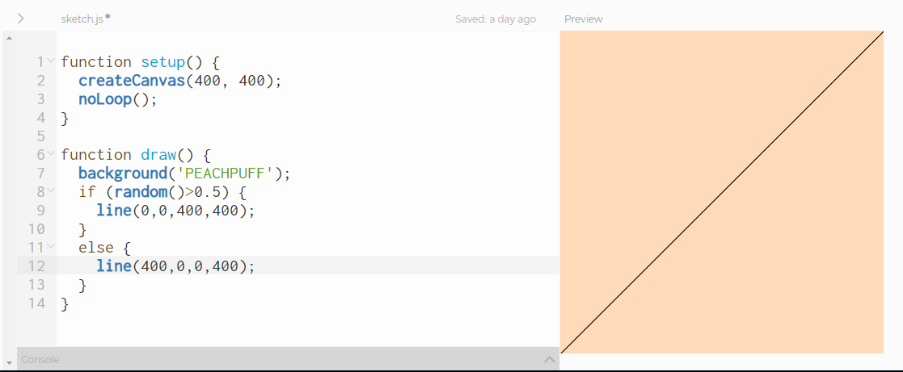

If you have two flickering lines on your sketch you may have forgotten the noLoop() command.

If you press the play button 10 or more times, you should sometimes get left lines and sometimes right ones.

The last thing we need to make the pattern we want is to draw these random lines in a grid and for that, we’ll need…

## For loops

If you’ve never done any programming before, this is probably the most complicated part of the tutorial.

A for loop, essentially, counts numbers. It starts at a specific number, ends at a specific number, and for each number it counts it perform some actions. You can also tell the for loop to count in specific steps so you could add 1 each time, you could add 20 each time, you can even count backwards by subtracting a number each time. One more thing you can do is you can base the action the loop performs each time on the number we’re at in the count. So if we’re at number 200, we could draw a line with an x-position of 200. Let’s have a look at what this looks like:

```
for (var count=0;count<400;count = count + 100) {  
  doAnAction;  
}
```

Let’s break that down. The first part looks like this:

```
var count = 0;
```

This creates something called a variable. A variable is a way of storing a value, we can then use that value later. The variable in this example is called `count` and it is set to 0. Now, whenever we use `count` in our code, it will be as if we are using 0. Don’t worry if you feel confused whilst we talk about variables or loops. The best way to get over the confusion is to play around with these ideas. Once you’ve done that enough times, it makes a lot more sense. Let’s jump to the last part of for loop:

```
count = count + 100
```

Remember how we said we can count in specific steps? Here we’re counting in steps of 100, each time the loop runs it adds 100 to `count`. So `count` starts at 0, then it becomes 100 the second time the loop is run, then 200, and the last time this loop is run `count` is 300. But why does it stop at 300?

```
count < 400;
```

This section tells the loop to run as long as `count` is less than 400 (400 is not included). Another way to think of it is that the loop stops when `count` is 400 or bigger. Let’s look at one more example. Again, don’t worry if you’re confused, once we add a loop to our code you’ll get the chance to play around with it which will help you get a better grasp of loops.

```
for (var x=0; x<10; x=x+1)
```

In this loop, the variable is called `x`, it starts at 0 and adds 1 each time it runs. The loop continues running as long as `x` is less than 10, this means it will run 10 times with these `x` values: 0,1,2,3,4,5,6,7,8,9.

Let’s put this in our code. We’ll draw some straight lines going from the top of the screen to bottom, all at different x-coordinates.

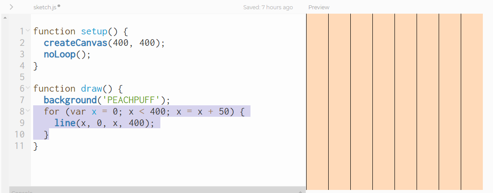

Woo! Loops! Isn’t it great that we don’t have to type out these 8 lines individually? We just use a for loop to get the computer to do it for us. Since loops can be confusing when you’re new to programming we’ll break this down a bit.

```
for (var x=0; x<400; x=x+50)
```

So the first time our loop runs the value of `x` is 0. The loop adds 50 each time it is run, and stops once `x` is 400 or bigger.

```
line(x,0,x,400);
```

We’re using that `x` variable that we get from loop to tell the computer where to draw the line. So the first line is drawn from `0,0` to `0,400`. The second line from `50,0` to `50,400` and so on. Before we go on, see if you can use what we’ve done so far to draw horizontal lines. Trying to use a concept you’re learning in different ways is a great way to get it to stick.

After you’ve had a go you can have a look at how I’ve done it:

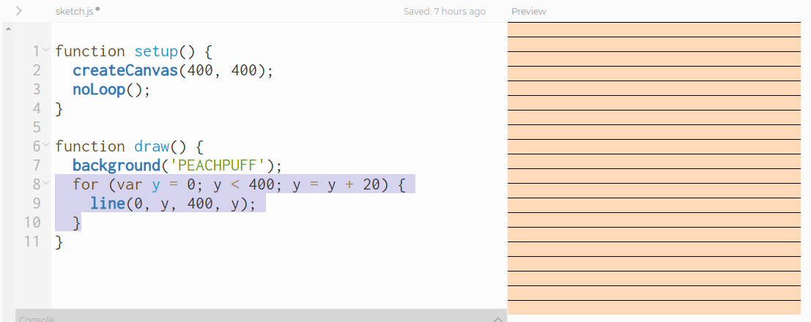

So many lines that we didn’t have to draw individually! They’re a bit on the thin side though. If you’d like them to a bit thicker you can use the `strokeWeight` command, before the line command:

```
function draw() {  
  background('PEACHPUFF');  
  for (var y = 0; y < 400; y = y + 20) {  
    strokeWeight(5);  
    line(0, y, 400, y);  
  }  
}
```

The lines in the original pattern were diagonal, so let’s make our lines diagonal too. To do this change your `line`command so it looks like this:

```
line(0, y, 400, y+20);
```

We’re the using the number 20 here twice. 20 is the distance between each of lines, and the step that the loop changes its variable by each time it’s run. We can put this number into its own variable, this way we can easily change it in just one place rather having to change it everywhere we use it.

```
var step = 20;
```

When you’ve added it to your code, it should look like this:

```
function draw() {  
  background('PEACHPUFF');  
  var step = 20;  
  for (var y = 0; y < 400; y = y + step) {  
    strokeWeight(5);  
    line(0, y, 400, y+step);  
  }  
}
```

Now you can try changing the `step` variable and see what effect it has. Feel free to play around with any of other values, or even add different lines or shapes inside or outside the loop.

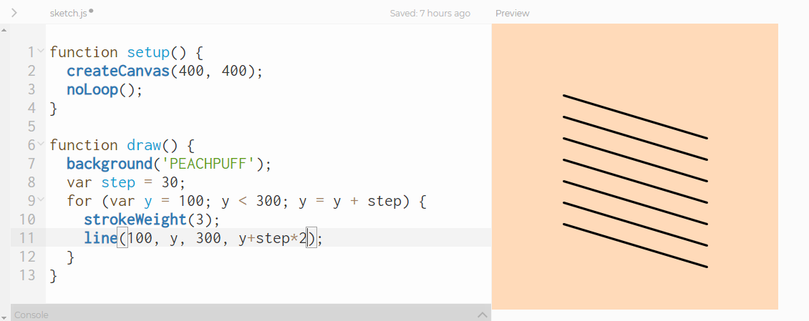


Don’t forget to save your work, if you’ve logged in. The editor doesn’t always save it automatically.

## Loops inside loops

Using loops, we’re now able to make lines that go across the page (x-axis) or down the page (y-axis). For our final pattern we need to make a grid of lines, that is lines that go both across and down. To do that we’re going to need two loops:

```
for (var x=0;x<5;x=x+1) {  
  for (var y=0;y<5;y=y+1) {  
    drawTheLines;  
  }  
}
```

If you’re new to coding it’s ok if you find this really confusing! Let’s see if we can break it down:

```
for (var x=0; x<5; x=x+1)
```

This is the same kind of loop we’ve been discussing so far, we have an `x` variable that starts at 0, each time the loop is run it adds 1 to `x` and it stops after running 5 times with `x` at 4.

```
for (var y=0; y<5; y=y+1)
```

This loop does exactly the same thing as the other one, except it uses a `y` variable. However, this loop is inside the `x` loop, so the entire loop is run 5 times. This is how we can programmatically do things in a grid. Here’s what the `x` and `y` values inside the inner loop would look like:

```
x=0, y=0; x=0, y=1; x=0, y=2; x=0, y=3; x=0, y=4;  
x=1, y=0; x=1, y=1; x=1, y=2; x=1, y=3; x=1, y=4;  
x=2, y=0; x=2, y=1; x=2, y=2; x=2, y=3; x=2, y=4;  
x=3, y=0; x=3, y=1; x=3, y=2; x=3, y=3; x=3, y=4;  
x=4, y=0; x=4, y=1; x=4, y=2; x=4, y=3; x=4, y=4;
```

Now we’ll use this loop inside a loop in our code and see what it does:

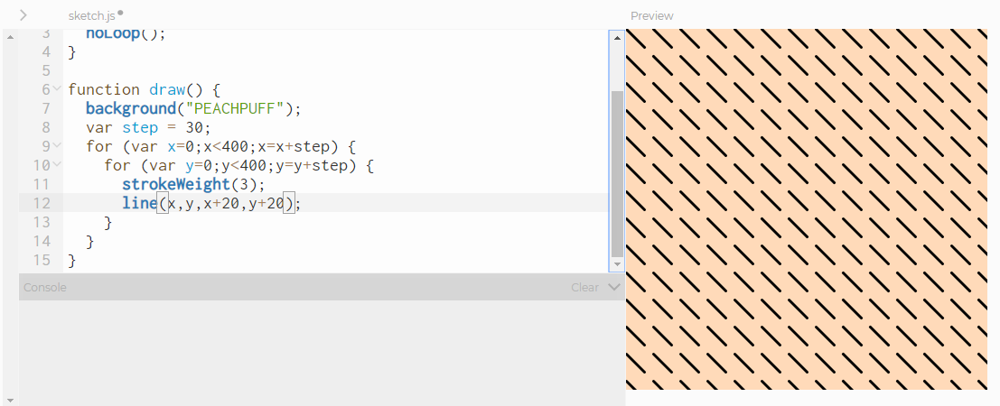

Note that I’ve added 20 to the x and y values rather than `step` so we can see the grid. If I had added `step` we would just see diagonal lines. Feel free to have a play with the code at this point, see if you can make any different patterns.

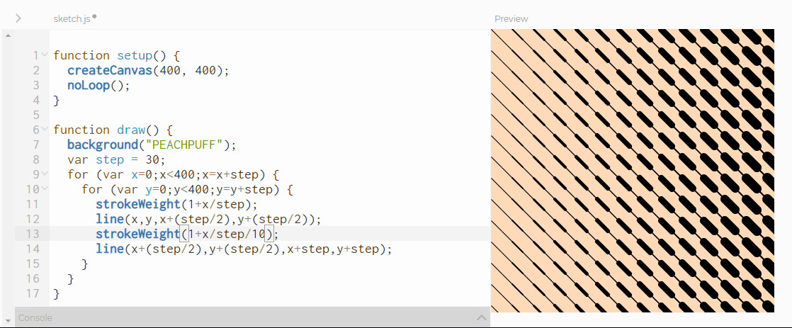

Changing the stroke weight based on the x-value

## Finishing off the pattern

Now all we have to do to get our pattern is to add the randomness back in. Earlier on we had an if-else statement that looked like this:

```
if (random()>0.5) {  
  line(0,0,400,400);  
}  
else {  
  line(400,0,0,400);  
}
```

We just need to change the line command so it works with the grid. As we’ve already seen to draw a left line inside the grid we draw the line starting at `x,y` and ending at `x+step,y+step`

```
line(x, y, x+step, y+step);
```

A right line starts at the top right corner of the grid box it’s in, `x+step,y`, and ends at `x,y+step`, the bottom left corner.

```
line(x+step, y, x, y+step);
```

Now, we can finally make our pattern!

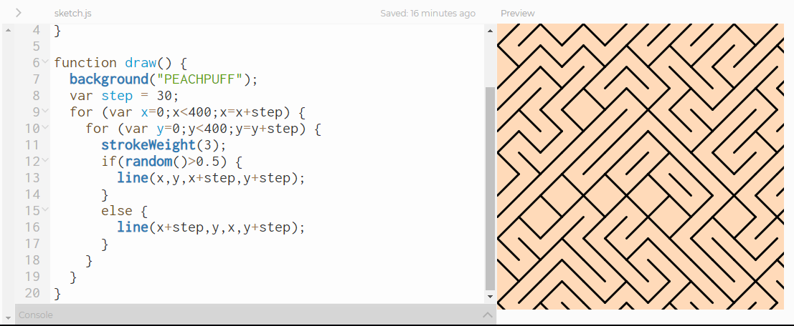

If you’ve made it this far, well done! That’s your first generative drawing. If you got lost at some point and would like a chance to play with the finished piece, you can [edit it here.](https://editor.p5js.org/PARC6502/sketches/n83M6C3GS)

If you have any questions, if you got stuck at any point or you have any comments on the tutorial this far please let me know, I’d be happy to help you out or improve on this article.

In the last couple of sections, I’ll introduce another programming concept called functions that will help us tidy up our code, and I’ll show some variations we can do with this pattern.

## Using functions

Functions can help us make our code less complicated. They allow us to group together commands which can then be reused multiple times.

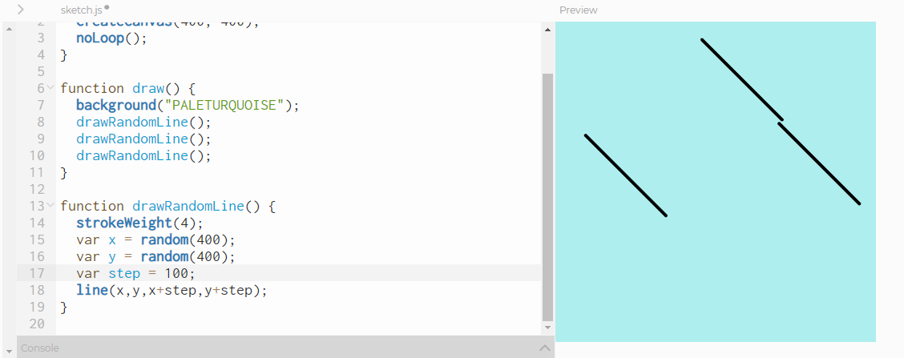

The commands for drawing the random lines you see are grouped together then are used them 3 times

The other way functions make code less complicated is abstraction. If I group together the commands for drawing either a left or right lines, I will only have to run one command inside the loop which will make it a lot more readable!

```
for (var x=0;x<400;x=x+step) {  
  for (var y=0;y<400;y=y+step) {  
    drawRandomLine();  
  }  
}
```

This is **almost** what it would look like. Let’s take a look at making functions:

```
function drawRandomLine() {
```

We use the `function`\` keyword to tell the computer we’re making a function, and after that, we put down the name of the function. We’ll use that name whenever we want to run our function somewhere else in the code.

So can we just copy the inside of the loop into our function?


Oops, looks like we got an error! The error says `x is not defined`\`, this is because our program knows about `x`\` and `y`\` inside of the loop, but now that we’ve defined the function outside the loop it doesn’t know what `x`\` `y`\` or `step`\` mean. We can give functions some extra information though. This works the same way that we give the `line`\` command or the `ellipse`\` command extra information, those are functions too!

```
function drawRandomLine(x,y,step) {  
  ...  
}
```

Now whenever we run the function, we have to give it those pieces of information: the x-coordinate, the y-coordinate and the step. Here’s what the code looks like with the `drawRandomLine` function:

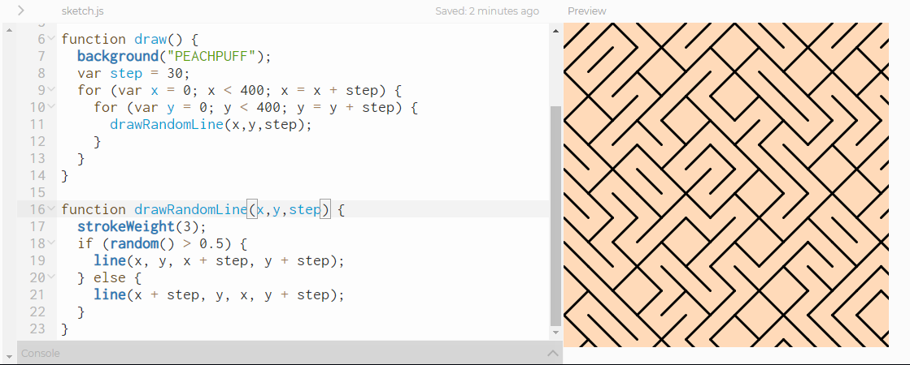

## Some variations

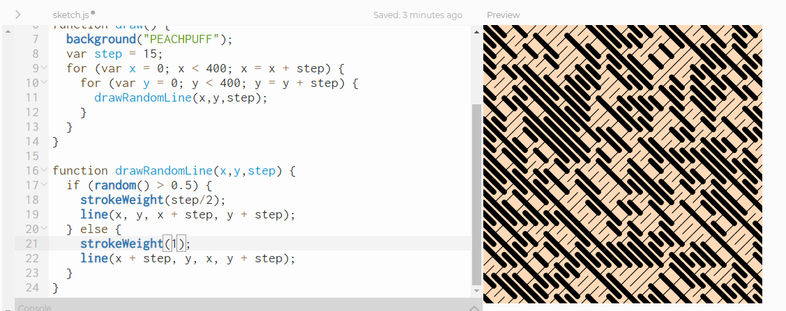

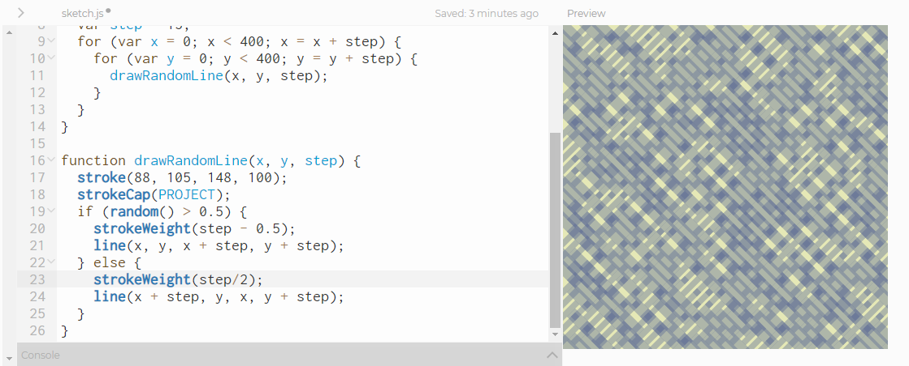

<!-- I used an openprocessing embed to share this slightly more complex one as it lets you view all the code, just press the `</>` -->


## Thanks for reading!

I hope you enjoyed this tutorial, and that you enjoy getting started on your generative art journey!
